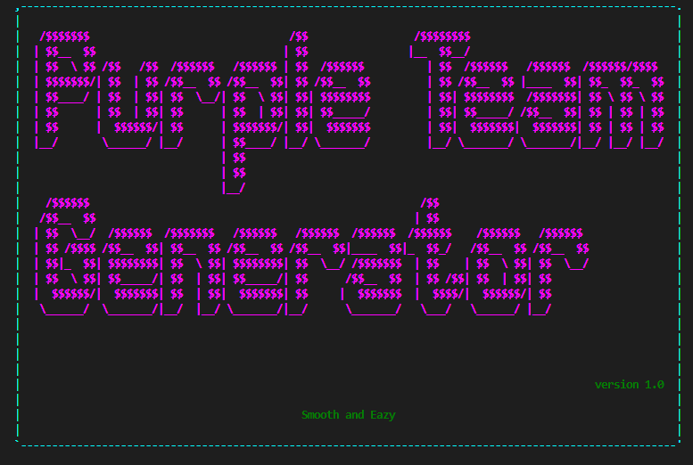
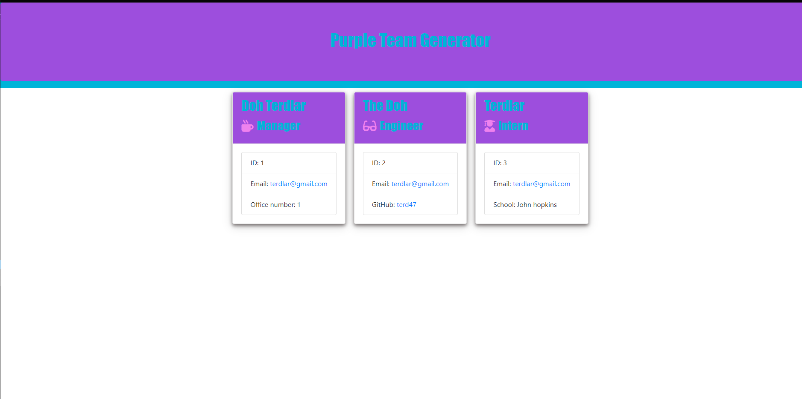

# Purple-team-generator-app
This is a command Line application which makes adding new team members in your organization simple and easy. It will generate an html page with new team members provided by the user. The application prompts the user for information about the team such as role, name, email, id, e.t.c. The user can input any number of team members, and they may be a mix of engineers and interns. Depending on the role of the employee being added, the program will ask additional questions such as; for an Engineer, it will ask for the engineer's github username, for a manager, it will ask for the managers office number and for an intern, it will ask for the intern's School. When the user has completed building the team, the application will create an HTML file that displays a nicely formatted team roster based on the information provided by the user. 

## Technologies used
* HTMl
* Node.js
* JavaScript
* Bootstrap
* Asciiart logo
* Jest testing
* OOP principles and methodologies

[Github Repository](https://github.com/Terd47/purple-team-generator-app)

